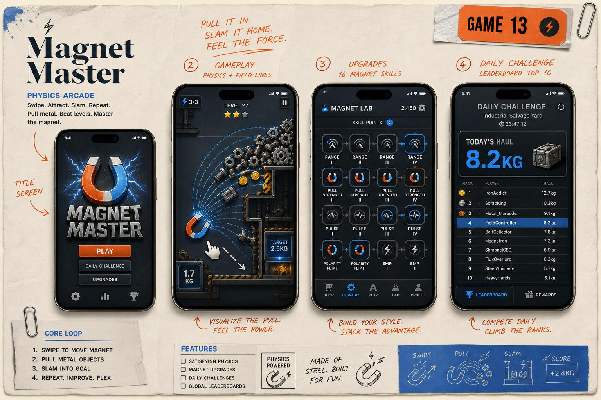

# Magnet Master

> **Pull it in. Slam it home. Feel the force.** — physics arcade, ahol mágnessel szedsz be fémeket.

## Koncepció

Side-view fizika-pálya. A játékos egy **mágnes-kurzort** húzogat ujjal. A pályán **vasdarabok** (csavar, fogaskerék, érme, törmelék) hevernek vagy lebegnek. A mágnes **vonzza** őket — minél közelebb és minél erősebb, annál gyorsabban. Cél: bevonzani egy meghatározott `KG` mennyiségű fémet a goal-csúzdába az idő letelte előtt. Kerülni: bomba, gumi, élesszélű (HP csökken). 16 fős skill-tree (range, pull-strength, pulse, polarity-flip, EMP).

## Hogyan kell játszani

1. **Drag** a mágnes-kurzor (vagy ujj a screenen direkt).
2. **Fémek field-line mentén** csapódnak hozzád.
3. **Drag a goal-csúzdához** → leadás.
4. **Tap-tap** → polarity-flip (taszít).
5. Idő letelte előtt elérni a `target KG`-t.

## Kulcs jellemzők

- 100+ szint, 4 environment (industrial, junkyard, ocean wreck, space scrap).
- 16-fős skill-tree, gem-driven.
- Daily challenge: salvage yard leaderboard top-100.
- Cosmetic mágnes-skin (neon, gold, plazma).
- Boss-szintek: óriás roncs, multi-phase (rip-bolts).
- Asszinkron PvP ghost-race (heti).

## Core loop

`Swipe magnet → Pull metal → Slam goal → Score → Upgrade → Repeat`

45–120 sec / szint.

## Képernyő-tervek (5 mockup)

| # | Képernyő | Tartalom |
|---|----------|----------|
| 1 | **Title** | Horseshoe-magnet logó electric arcs-szel, „PLAY". |
| 2 | **Gameplay** | Side-view pálya, ujj-mágnes, field-lines, fémek áradnak. |
| 3 | **Skill Tree** | 16 node, 4 ág (Range / Pull / Pulse / Polarity). |
| 4 | **Daily Leaderboard** | Today's haul 8.2 kg, rank #4. |
| 5 | **Boss** | Óriás autóroncs, 3 phase HP-bar. |

## Progresszió és nehézség

- **Target KG:** `T(n) = 1.5 + 0.15·n`.
- **Time:** csökken `90 - n/2` sec.
- **Distractor (bomba):** `B(n) = floor(n/10)`.
- **DDA:** ha 3× fail, +10% time.

## Monetizáció

- **Rewarded:** +15s timer, 2× score, free skill-point, EMP power-up, daily wheel.
- **IAP:** Gem packs 0.99–19.99, Magnet skin bundle 4.99, Starter pack 4.99 (gems + skill resets), No-ads 2.99, Battle Pass 9.99/szezon, VIP 4.99/hó.
- **Interstitial:** 3 szintenként, capping 90s.

## Tech specs (MVP)

- React + matter.js 2D physics (custom magnet-force module).
- Field-line render: SVG / Canvas overlay.
- Skill-tree state: Zustand + cloud save.
- Lovable Cloud: leaderboard, daily seed, IAP receipts, ad SSV.
- App méret: < 35 MB.
- Dev idő: 6 hét.

## Miért fog sikerülni

- Új, márkázható mechanika (nem létezik versenytárs!).
- Vizuális elégedettség + haptic feedback = retention.
- Skill-tree = deep meta = LTV.
- Daily leaderboard = competitive layer.
- Boss + asszinkron PvP = bind-effekt.

## Célközönség és piacok

- 12–40 év, férfi skew (~58%), arcade + physics-rajongók.
- Top: USA, BR, IN, ID, RU, DE.
- ASO: `magnet`, `physics`, `pull`, `arcade`, `slam`, `metal`, `puzzle`.

## Brand

Steel Gray `#2B313A`, Electric Blue `#2F8DFF`, Safety Orange `#FF7A2A`, Bone `#F2ECE3`. Font: Fraunces + Inter Tight + JetBrains Mono.

## KPI cél

D1 ≥ 42%, D7 ≥ 20%, D30 ≥ 8%, ARPDAU ≥ 0.10, session 90s × 5/nap.